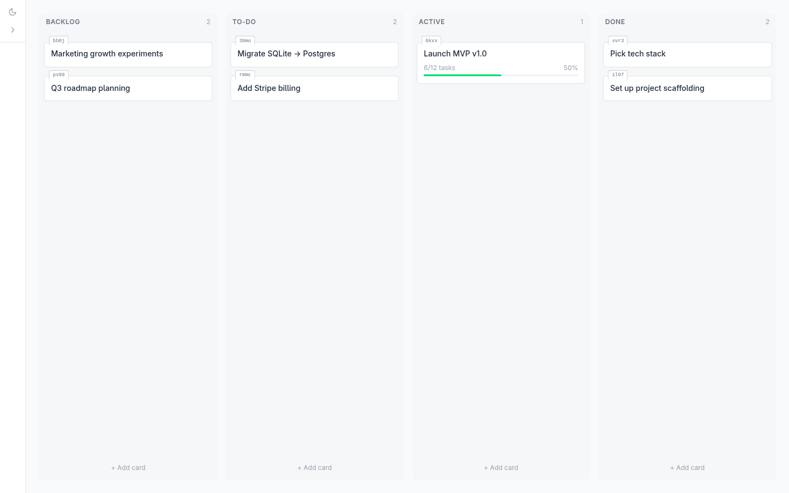
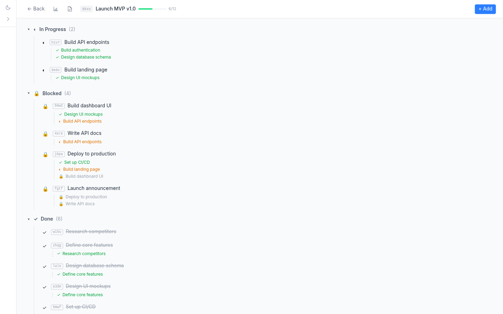
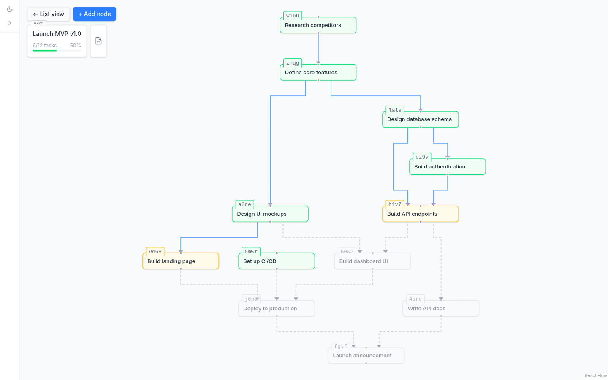

# Kanban

A personal kanban board that breaks each card into a **dependency graph of subtask nodes**. Nodes auto-lock when their dependencies aren't done and auto-unlock as work flows through the graph — so at a glance you can see what's ready to pick up next.

Built to be controllable from the command line via a simple REST API — the idea is that you (or an LLM agent you're collaborating with) can drive the board programmatically as work progresses.

## Screenshots

### Board view — cards grouped by column



### List view — nodes grouped by status, with dependencies inline



### Canvas view — the full dependency graph



Node colors: green = done, orange = in progress, grey = locked (waiting on dependencies). Arrows show what blocks what.

## Stack

- **Client:** React + TypeScript + Vite + React Flow (for the canvas)
- **Server:** Node + Express + better-sqlite3
- **Shared:** TypeScript types shared across client/server
- Monorepo via npm workspaces

## Run it

```bash
npm install
npm run dev
```

- UI: <http://localhost:5174>
- API: <http://localhost:3001>

A SQLite file (`kanban.db`) is created on first run in the repo root.

## REST API

All create endpoints expect a client-generated 4-char alphanumeric `id`.

### Boards

- `GET /api/boards` — list boards
- `POST /api/boards` — create `{ id, name }`
- `PATCH /api/boards/:id` — rename
- `DELETE /api/boards/:id` — cascades to cards and nodes

### Cards

Columns: `backlog`, `todo`, `active`, `done`.

- `GET /api/boards/:boardId/cards`
- `POST /api/boards/:boardId/cards` — `{ id, title, column? }`
- `PATCH /api/cards/:id` — move column, rename, etc.
- `DELETE /api/cards/:id`

### Nodes

Statuses: `locked`, `unlocked`, `in_progress`, `done`. Locked/unlocked is computed from dependencies. You set `in_progress` and `done` manually.

- `GET /api/cards/:cardId/nodes`
- `POST /api/cards/:cardId/nodes` — `{ id, title, description? }`
- `PATCH /api/nodes/:id` — title, description, notes, deadline, status
- `DELETE /api/nodes/:id`
- `GET /api/nodes/:id/context` — node + card + board + siblings + deps + doc, all in one call

### Dependencies

- `POST /api/nodes/:id/dependencies` — `{ id, dependsOnId }`
- `DELETE /api/nodes/:id/dependencies/:depId`

### Card docs

Each card has a markdown file at `docs/<card-id>.md` — meant for working notes, decisions, session logs.

- `GET /api/cards/:id/doc`
- `PUT /api/cards/:id/doc` — `{ content }`

## License

MIT
